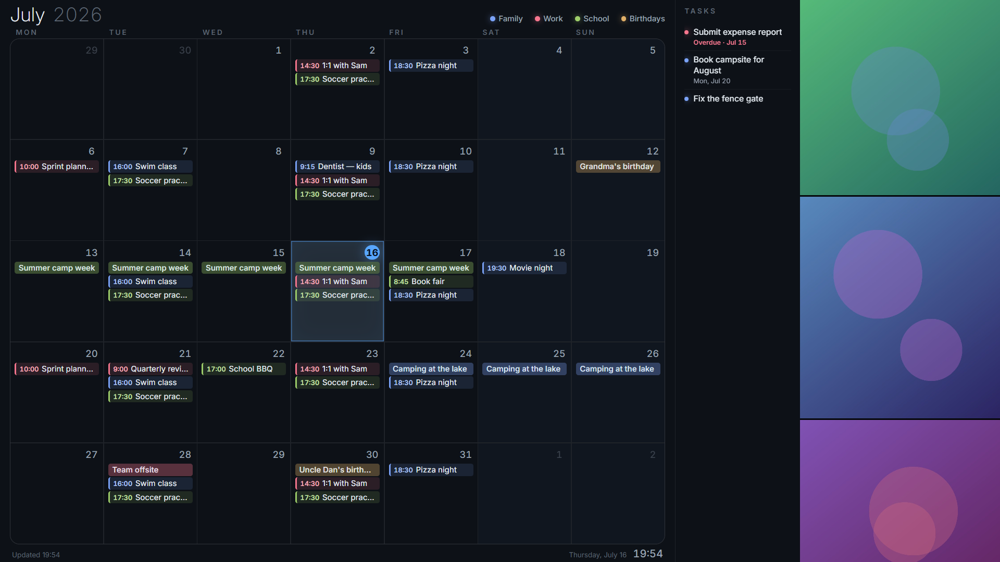
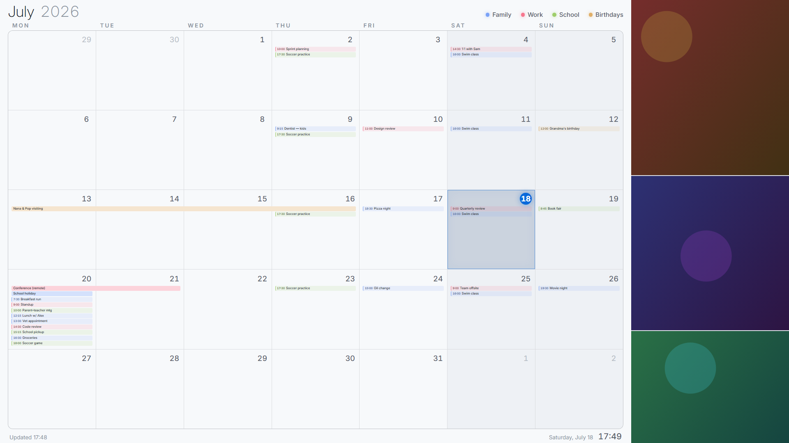
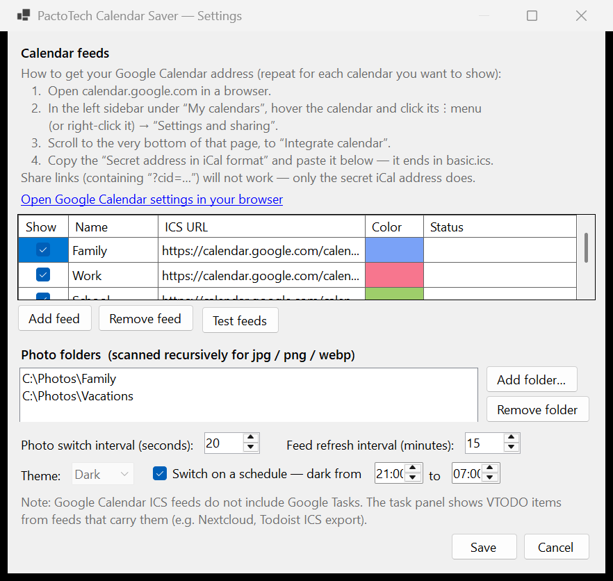

# PactoTech Calendar Saver

**Download & setup guide: [calendarsaver.com](https://calendarsaver.com/)**

A Windows 11 screensaver that turns your monitor into a wall calendar: a full-month view
aggregated from any number of Google Calendar (or other) ICS feeds, plus a photo
slideshow collage. Designed to be read from across the room.

**Download & setup guide: [calendarsaver.com](https://calendarsaver.com/)**



Light theme (fixed, or on a schedule — e.g. light during the day, dark at night):



## Features

- **Month view** aggregated from multiple ICS feeds, each with its own name and color;
  a color legend sits at the top of the page. Feeds can be toggled on/off in settings
  without deleting them.
- **Every event is always visible** — no "+3 more". The busiest day drives a global
  auto-scale of event text so everything fits.
- Recurring events (RRULE, EXDATE, moved instances) expanded correctly; all times
  converted to local; all-day and multi-day events render as spanning bars.
- **Photo slideshow collage** from local folders (scanned recursively), tiles crossfade
  one at a time. No photos configured → the calendar takes the full width.
- **Dark and light themes**, either fixed or scheduled (dark from HH:mm to HH:mm).
- Feeds refresh on an interval and are cached on disk — an offline start or a dead URL
  still shows the last good data, with a note in the footer.
- Automatic month rollover at midnight. Clock and status in a slim footer.
- Exits on any keypress or real mouse movement (>10 px cumulative — jitter-proof).

## Install

1. Download / build `PactoTechCalendarSaver.scr` (self-contained, no .NET install needed).
2. Right-click it → **Install**.
3. In Windows' Screen Saver Settings, select **PactoTechCalendarSaver** → **Settings…**



### Adding Google Calendar feeds

For each calendar you want to show (the dialog has these instructions built in):

1. Open [calendar.google.com](https://calendar.google.com) in a browser.
2. In the left sidebar under "My calendars", hover the calendar and click its ⋮ menu
   (or right-click it) → **Settings and sharing**.
3. Scroll to the very bottom of that page — **Integrate calendar**.
4. Copy the **Secret address in iCal format** (ends in `basic.ics`) and paste it into
   the settings dialog.

Share links (containing `?cid=…`) will not work — only the secret iCal address does.
The **Test feeds** button live-checks every URL and reports how many events it carries.

Settings persist to `%APPDATA%\PactoTechCalendarSaver\settings.json`. Feed caches, the
WebView2 profile, and `error.log` live in `%LOCALAPPDATA%\PactoTechCalendarSaver\`.

### Notes

- There is no task list. Google Calendar ICS exports do **not** include Google Tasks;
  the code has a dormant VTODO renderer and an `ITaskSource` seam where a Google Tasks
  integration could plug in later, but no shipped feed populates it.
- Google's built-in Birthdays calendar usually has no secret iCal address; holiday
  calendars expose a *public* iCal address that works fine.
- If photos live in Dropbox/OneDrive with "online-only" files, the first display of each
  photo waits for the sync client to download it. Mark the folder as always-available
  for instant slideshows.

## Build from source

Requires the .NET 8 SDK:

```powershell
cd CalendarSaver
dotnet publish -c Release -r win-x64 -p:PublishSingleFile=true --self-contained true
Copy-Item bin\Release\net8.0-windows\win-x64\publish\PactoTechCalendarSaver.exe ..\PactoTechCalendarSaver.scr -Force
```

Self-contained publish (~64 MB) runs on any Windows 11 machine. If you have the .NET 8
Desktop Runtime installed system-wide, `--self-contained false` shrinks it to ~2 MB.

## Dev loop

- `PactoTechCalendarSaver.exe /s` — run fullscreen
- `PactoTechCalendarSaver.exe /w` — run in a 1920×1080 window that ignores input-exit
  (for screenshots and development)
- `PactoTechCalendarSaver.exe /c` — settings dialog
- `PactoTechCalendarSaver.exe /d [out.json]` — fetch feeds per current settings and dump
  the JSON payload the page receives (feed URLs may also be local `.ics` paths — handy
  for testing)
- Open `CalendarSaver/wwwroot/index.html` directly in a browser — it renders itself with
  rich mock data (`?theme=light` for the light theme)
- DEBUG builds enable WebView2 devtools

## Architecture

A .NET 8 WinForms host embeds a single WebView2 page that does all rendering.

- **C# host** ([CalendarSaver/](CalendarSaver)): screensaver argument plumbing (`/s /c /p`),
  fetching and caching ICS feeds, RRULE expansion via [Ical.Net](https://github.com/rianjs/ical.net)
  (with an explicit TZID→local conversion — Ical.Net 4.x's `AsSystemLocal` doesn't apply
  the TZID), photo folder scanning, settings dialog, and pushing one JSON payload into
  the page via `PostWebMessageAsJson`.
- **Web page** ([CalendarSaver/wwwroot/](CalendarSaver/wwwroot)): layout, theming, the
  event auto-fit (binary search on a global scale factor), the slideshow, and input
  detection (relayed to the host to exit — WebView2 swallows input from WinForms).
- The page is served from a virtual host mapped to files extracted into
  `%LOCALAPPDATA%` (the `.scr` runs from System32 and never reads files beside itself;
  the WebView2 user-data folder is set explicitly for the same reason). If that
  navigation fails — some security software interferes with WebView2 virtual hosts —
  the host automatically falls back to `file://`.
- **Photos are streamed by the host** through `WebResourceRequested` interception
  (`https://photosN/…`), which works regardless of page origin and needs no filesystem
  mapping.
- Layout constants worth knowing: `TASK_PANEL_POSITION` in `app.js` positions the
  dormant VTODO panel (side column or bottom strip) if a feed ever supplies to-dos.

Originally built from [calendar-screensaver-spec.md](calendar-screensaver-spec.md).

## License

MIT — free to use, modify, and redistribute **with attribution**: keep the copyright and
license notice (see [LICENSE](LICENSE)) in any copy or substantial portion you distribute.

Scope note: the license covers the software (`CalendarSaver/`, the built `.scr`, `docs/`).
The website content in `site/` — copy, images, branding, and affiliate configuration — is
© Pacto Tech and not licensed for reuse.
